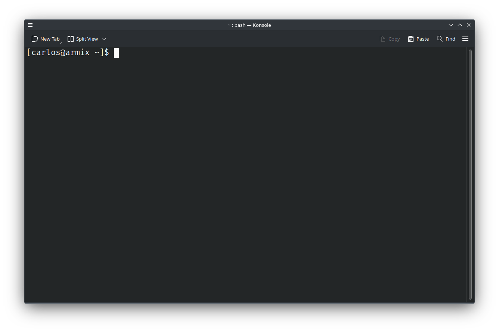
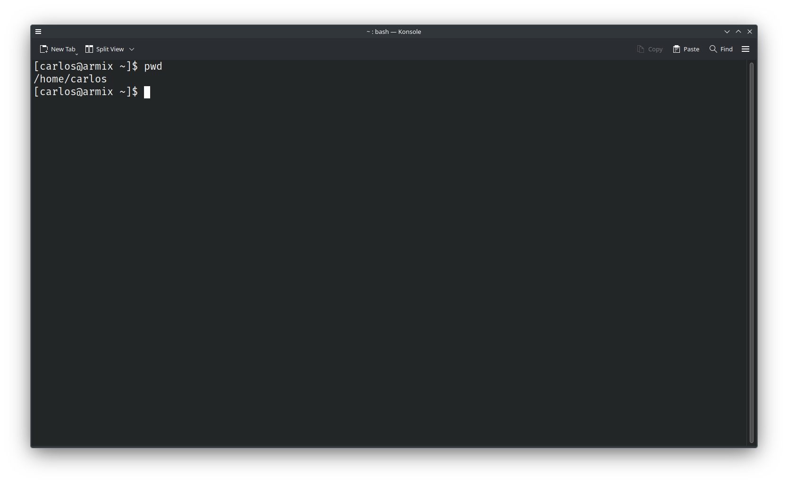
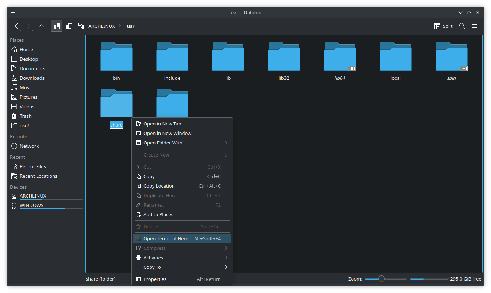
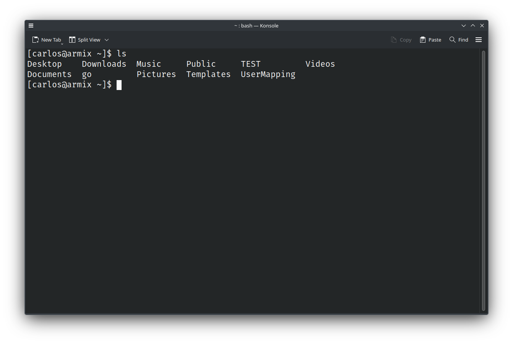
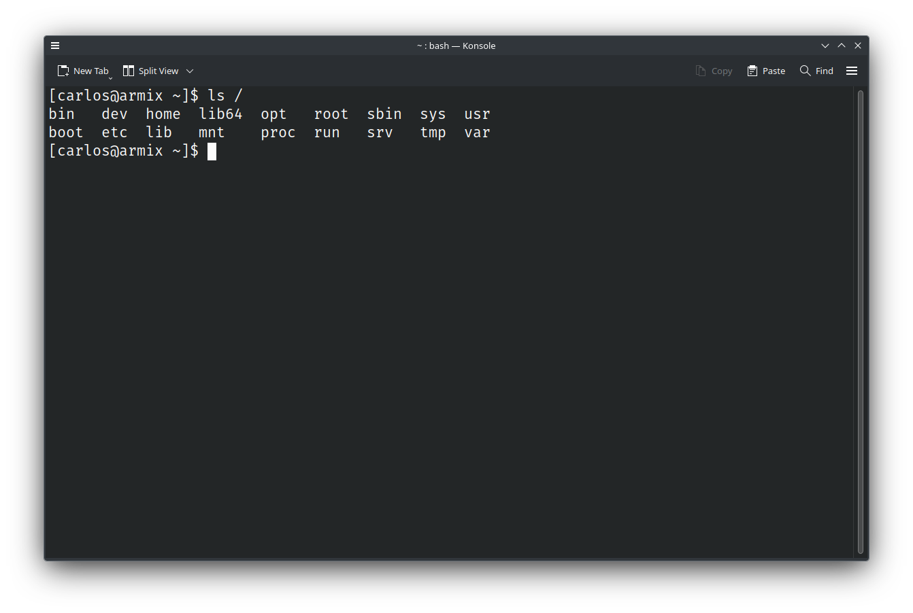
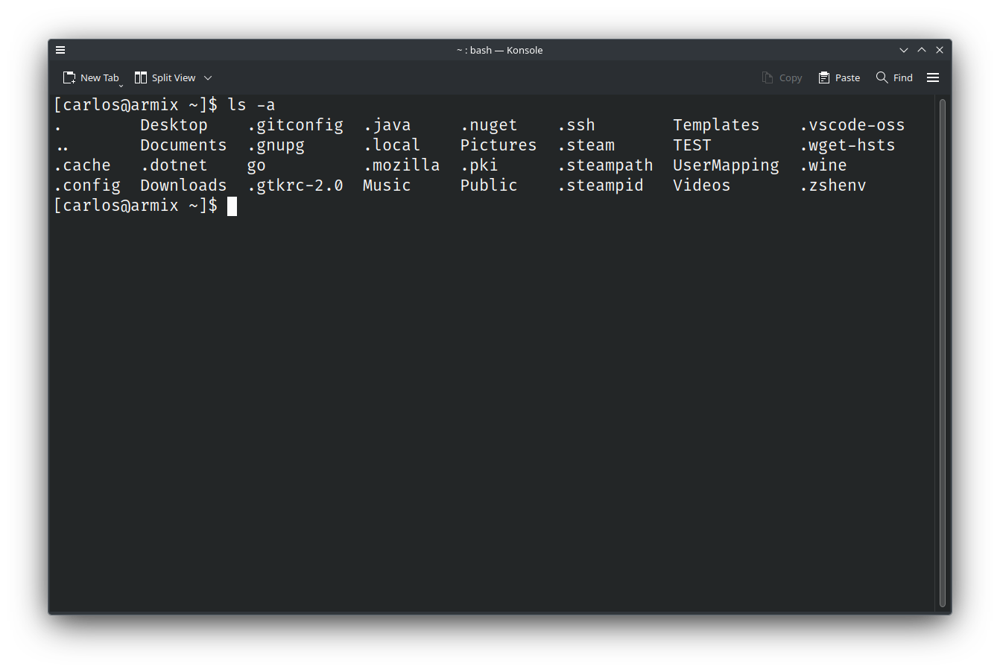
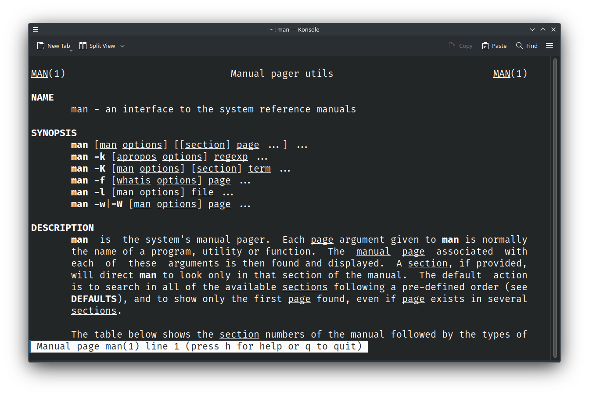

# Introdução ao Terminal

Bem-vindo à **Introdução ao Terminal** do NuCC.
Este guia tem como objetivo ensinar-te o essencial para poderes usar o terminal.

Não vale a pena estar a preencher isto com texto desnecessário, por isso vamos começar já.

## Terminal e Shell

Começa por abrir o terminal.
Dependendo da distribuição Linux que estás a usar, o terminal pode ter nomes diferentes por causa do
  ambiente que a tua distribuição usa.
Nalgums chama-se **Gnome Terminal**, noutros **Konsole**, e noutros outra coisa qualquer, mas se
  procurares simplesmente por **`terminal`** deve-te aparecer a aplicação correta, que vai ter mais
  ou menos este aspeto:

Na realidade temos dois programas a correr aqui.
Primeiro temos o terminal em si, que trata só da parte gráfica, como por exemplo o tipo de letra e
  tamanho da janela.
O segundo programa é a **shell**, e está a correr dentro do terminal.
A shell é o programa que dá output do texto (incluindo o que aparece ao iniciar o terminal), e lê,
  interpreta, e executa os comandos que lhe dás.

_**Basicamente, o cérebro do terminal é a shell.**_

Existem várias shells, mas quase todas as distribuições usam a mesma por predefinição: **`bash`**.

  
NOTA: Acerca do nome <b>terminal</b>

  Na realidade um terminal é o ecrã preto que (possivelmente) aparece quando ligas o computador.
  O "terminal" que estamos a usar é um <b>emulador de terminal</b>, mas não vale a pena estar a ser
    tão pedante.

### Prompt

O **prompt** é o texto que está no screenshot acima, e aparece sempre que a shell está à espera de
  um comando.
Serve para indicar o estado atual da shell.

O prompt é algo que pode ser configurado, e distribuições diferentes provavelmente vão ter o prompt
  ligeiramente (ou muito) diferente umas das outras.
Para não estar a complicar muito, vamos analisar o prompt do screenshot.

 - `[`: Só um separador visual, não tem significado especial.
 - `carlos`: Nome do utilizador atual.
 - `@`: Outro separador, no entanto o `@` costuma ser usado para indicar uma localização.
 - `armix`: Hostname do sistema atual.
 - `~`: Pasta atual. Nas shells, `~` indica a pasta pessoal do utilizador atual.
 - `]`: Mais um separador visual, não tem significado especial.

E no fim, o prompt acaba com um `$`, que indica o final do prompt e também indica que estamos com um
  utilizador normal.
Normalmente as shells estão configuradas para mostrar `#` quando estamos com o utilizador `root`,
  que no Linux é o utilizador que serve de administrador, com acesso total ao sistema.

## `pwd`

Vamos então começar com comandos.

O primeiro comando que vamos ver é bastante simples, e chama-se `pwd` (**P**rint **W**orking
  **D**irectory).
Experimenta correr o comando.
Escreve `pwd` e carrega _Enter_, vais ter um output do género:

No teu caso a pasta deve ter um nome diferente por causa do nome to teu utilizador, mas também deve
  estar dentro da pasta `/home`, que é a pasta onde as pastas pessoais costumam ficar.

O `pwd` é raramente usado, não por ser um comando bastante simples, mas porque a informação que ele
  dá já está disponível no prompt.
Experimenta abrir o teu explorador de ficheiros e carregar com o botão direito do rato numa pasta
  qualquer.
Deve-te aparecer uma opção do estilo "abrir o terminal aqui" (se não tiveres essa opção, azar):

Carrega nela e executa `pwd` no terminal que te aparece:

Experimenta fazer isto em mais pastas, ou se quiseres, podes passar já para o próximo comando.

  
CURIOSIDADE: Diferença entre <b>pastas</b> e <b>diretórios</b>

  Não há realmente uma diferença entre os dois termos.
  "Diretório" era o termo usado antigamente, e com o surgimento de GUIs, o nome "pasta" começou a
    ser utilizado.

  Há quem diga que há realmente uma diferença, e até podem ter alguma razão (aceito
    [este](https://retrocomputing.stackexchange.com/a/26176) argumento), mas há dois casos que não
    tem razão absolutamente nenhuma:
  <ul>
    <li>Se disserem que "diretório" é o quando usas o terminal e "pasta" é o quando usas GUI.</li>
    <li>Se disserem que é "pasta" no Windows e macOS, e "diretório" nos outros SOs.</li>
  </ul>
  Esse pessoal tem só problemas na cabeça.

## `ls`

O próximo comando que vamos ver é o `ls` (**L**i**S**t), que serve para listar o conteúdo de pastas.

Basta fazer `ls` e ficas a saber o que está dentro da pasta atual:

### Argumentos

Os comandos podem receber argumentos, que são separados por espaços, e normalmente servem para
  indicar onde ou em que coisa é que queres executar o comando.
Para usares argumentos, basta po-los à frente do comando.

No caso do `ls`, os argumentos que ele espera são pastas, para quando quiseres ver o conteúdo duma
  pasta estando noutra.

Experimenta fazer `ls /` (a pasta `/` é a pasta pai de todas as outras, uma espécie de `C:\` do
  Linux):

### Caminhos

Para usar o `ls` noutra pasta, tens que indicar o caminho dessa pasta, e existem dois tipos de
  caminhos, **absolutos** e **relativos**.

Os caminhos absolutos são caminhos que começam por `/` (a pasta pai que acabamos de ver), enquanto
  que os caminhos relativos não, e são relativos à pasta atual em que estás.

Por exemplo, eu estando na minha pasta pessoal, que no meu caso o caminho absoluto é `/home/carlos`,
  para listar o conteúdo da pasta de documentos, posso usar o caminho absoluto e fazer
  `ls /home/carlos/Documents`, ou entao posso usar o caminho relativo e fazer `ls Documents`.

### Flags

Existe um tipo especial de argumentos, chamados de flags.
As flags servem para alterar o funcionamento dos comandos, e cada comando tem as suas flags, não são
  coisas que todos os comandos partilham.

Existem flags curtas, que começam por `-`, e flags longas, que começam por `--`.
Normalmente, as flags curtas são compostas por um carater (por exemplo `-i`), e as flags longas são
  compostas por palavras (por exemplo `--ignore-case`).
Quase sempre, cada flag curta tem uma flag longa correspondente, mas o oposto já não é tão comum.

Muitos programas também aceitam juntar flags curtas numa só para não ocuparem tanto espaço.
Por exemplo, no comando `ls` que estamos a ver, as flags `-A -l -h` podem ser escritas como `-Alh`.

Flags também podem receber argumentos.
Nas flags curtas os argumentos costumam ser separados por um espaço (por exemplo `-f fich.txt`), e
  nas flags longas costumam ser separados por um `=` (por exemplo `--file=fich.txt`).

### Ficheiros Escondidos

Com isto, vamos usar flags para mudar o comportamento do `ls`.
Por predefinição o `ls` só mostra os ficheiros e pastas normais, mas também existem ficheiros e
  pastas escondidos.
Estes são os que têm o nome a começar por `.`.

Para podermos listar o conteúdo todo de uma pasta, incluindo o que está escondido, podemos usar a
  flag `-a` (ou `--all` que é o equivalente na forma longa):

### Pseudo-Pastas

Deves ter reparado no último screenshot que apareceram duas pastas com uns nomes que não parecem
  fazer muito sentido: `.` e `..`.
Estas são na realidade pseudo-pastas, e existem em todas as pastas, mesmo as que estão vazias.

`.` é a pasta atual, ou seja, se fizeres `ls .` recebes o mesmo output que se fizeres só `ls`.
Esta pseudo-pasta serve na maioria do casos para correr um ficheiro executavél que está na pasta
  atual.
Já agora, praticamente todos os comandos neste guia são ficheiro executáveis também, mas estão em
  pastas especiais que os pertime serem executados a partir de qualquer pasta.

A pasta `..` é a pasta pai, ou seja, se eu estiver na pasta `/home/carlos`, fazer `ls ..` vai-me
  mostrar o conteúdo da pasta `/home`.
Também podes usar `..` várias vezes no mesmo caminho.
Seguindo o exemplo anterior em que estou na minha pasta pessoal, se eu fizer `ls ../..`, vou receber
  o conteúdo da pasta `/`.

Estas pastas ainda podem parecer um bocado esquisitas, mas acredita, vais usá-las imenso.

## `man`

Se estiveres a pensar "Onde é que descubro que flags é que cada comando suporta?", a resposta é
  `man` (**MAN**ual).
O comando `man` mostra bastante informação sobre cada comando, tal como se usa, que flags suporta,
  etc.

Para o usares basta fazer <code>man <b>[commando]</b></code>.
Por exemplo, `man ls`.
E sim, também podes fazer `man man`:

Para percorrer cada manual, usa as setas do teclado (alguns terminais suportam usar a roda do rato).
Para sair do manual carrega na tecla `Q`.

Além de comandos, o `man` também pode ser usado para mostrar informação sobre outras coisas.
Por exemplo, se fizeres `man 3 stdio`, o `man` vai-te dar informação sobre a biblioteca `stdio` do
  C (o `3` indica a secção onde o `man` vai buscar a informação (lê o `man man`)).

## `mkdir`

### Espaços no terminal

## `cd`

## `clear`

### Ctrl + D

## `touch`

## `rmdir`

## `rm`

### Perigos do `rm`

## `cp`

## `mv`

## `echo`

### Variáveis de Ambiente

## `cat`

## `less`

## `grep`

## `sudo`

### Perigos do `sudo`

### Instalação de Aplicações

## Perigos de Comandos na Internet

### explainshell.com

## Operadores

### `|`

### `&`

### `&&`, `||`, e `;`

## `kill`
