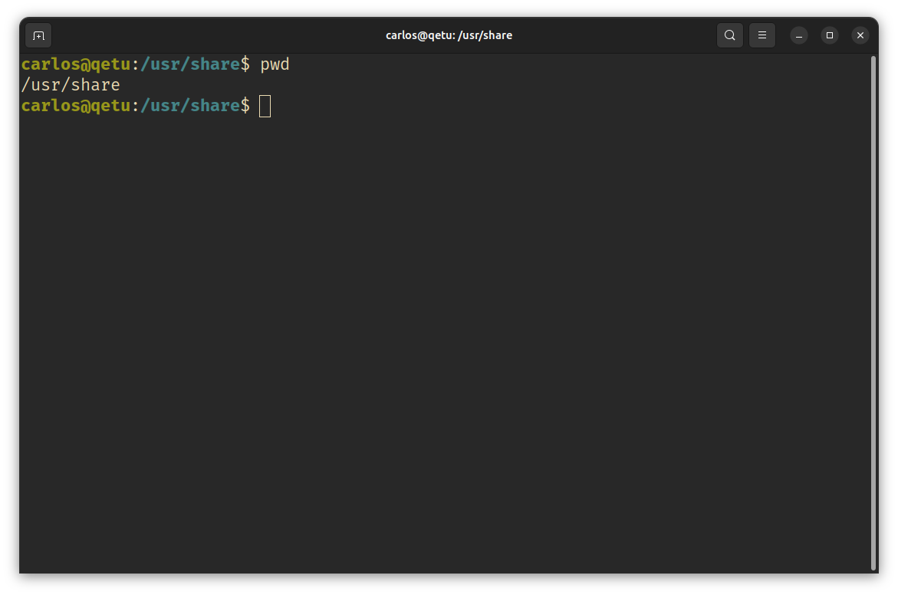
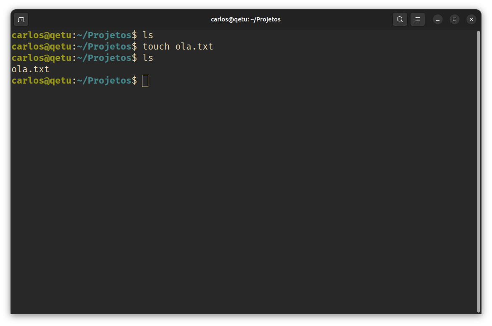

# Introdução ao Terminal

Bem-vindo à **Introdução ao Terminal** do NuCC.
Este guia tem como objetivo ensinar-te o essencial para poderes usar o terminal.

Não vale a pena estar a preencher isto com texto desnecessário, por isso vamos começar já.

## Terminal e Shell

Começa por abrir o terminal.
Dependendo da distribuição Linux que estás a usar, o terminal pode ter nomes diferentes por causa do
  ambiente que a tua distribuição usa.
Nalguns chama-se **Gnome Terminal**, noutros **Konsole**, e noutros outra coisa qualquer, mas se
  procurares simplesmente por **`terminal`** deve-te aparecer a aplicação correta, que vai ter mais
  ou menos este aspeto:

Na realidade temos dois programas a correr aqui.
Primeiro temos o terminal em si, que trata só da parte gráfica, como por exemplo o tipo de letra e
  tamanho da janela.
O segundo programa é a **shell**, e está a correr dentro do terminal.
A shell é o programa que dá output do texto (incluindo o que aparece ao iniciar o terminal), e lê,
  interpreta, e executa os comandos que lhe dás.

_**Basicamente, o cérebro do terminal é a shell.**_

Existem várias shells, mas quase todas as distribuições usam a mesma por predefinição: **`bash`**.

  
NOTA: Acerca do nome <b>terminal</b>

  Na realidade um terminal é o ecrã preto que (possivelmente) aparece quando ligas o computador.
  O "terminal" que estamos a usar é um <b>emulador de terminal</b>, mas não vale a pena estar a ser
    tão pedante.

### Prompt

O **prompt** é o texto que está no screenshot acima, e aparece sempre que a shell está à espera de
  um comando.
Serve para indicar o estado atual da shell.

O prompt é algo que pode ser configurado, e distribuições diferentes provavelmente vão ter o prompt
  ligeiramente (ou muito) diferente umas das outras.
Para não estar a complicar muito, vamos analisar o prompt do screenshot.

 - `carlos`: Nome do utilizador atual.
 - `@`: Um separador visual.
   - (o `@` costuma ser usado para indicar uma localização, como é o caso aqui)
 - `qetu`: Hostname do sistema atual.
 - `:`: Mais um separador visual, este não tem significado especial.
 - `~`: Pasta atual. Nas shells, `~` indica a pasta pessoal do utilizador atual.

E por fim, temos um `$`, que indica o final do prompt e também indica que estamos com um utilizador
  normal.
Normalmente as shells estão configuradas para mostrar `#` quando estamos com o utilizador `root`,
  que no Linux é o utilizador que serve de administrador, com acesso total ao sistema.

## `pwd`

Vamos então começar com comandos.

O primeiro comando que vamos ver é bastante simples, e chama-se `pwd` (**P**rint **W**orking
  **D**irectory).
Experimenta correr o comando.
Escreve `pwd` e carrega _Enter_, vais ter um output do género:

No teu caso a pasta deve ter um nome diferente por causa do nome to teu utilizador, mas também deve
  estar dentro da pasta `/home`, que é a pasta onde as pastas pessoais costumam ficar.

O `pwd` é raramente usado, não por ser um comando bastante simples, mas porque a informação que ele
  dá já está disponível no prompt.
Experimenta abrir o teu explorador de ficheiros e carregar com o botão direito do rato numa pasta
  qualquer.
Deve-te aparecer uma opção do estilo "abrir o terminal aqui" (se não tiveres essa opção, azar):

Carrega nela e executa `pwd` no terminal que te aparece:

  
CURIOSIDADE: Diferença entre <b>pastas</b> e <b>diretórios</b>

  Não há realmente uma diferença entre os dois termos.
  "Diretório" era o termo usado antigamente, e com o surgimento de GUIs, o nome "pasta" começou a
    ser utilizado.

  Há quem diga que há realmente uma diferença, e até podem ter alguma razão (aceito
    [este argumento](https://retrocomputing.stackexchange.com/a/26176)), mas há dois casos que não
    tem razão absolutamente nenhuma:
  <ul>
    <li>Se disserem que "diretório" é o quando usas o terminal e "pasta" é o quando usas GUI.</li>
    <li>Se disserem que é "pasta" no Windows e macOS, e "diretório" nos outros SOs.</li>
  </ul>

## `ls`

O próximo comando que vamos ver é o `ls` (**L**i**S**t), que serve para listar o conteúdo de pastas.

Basta fazer `ls` e ficas a saber o que está dentro da pasta atual:

### Argumentos

Os comandos podem receber argumentos, que **são separados por espaços**, e normalmente servem para
  indicar onde ou em que coisa é que queres executar o comando.
Para usares argumentos, basta pô-los à frente do comando.

No caso do `ls`, os argumentos que ele espera são pastas, para quando quiseres ver o conteúdo duma
  pasta estando noutra.

Experimenta fazer `ls /` (a pasta `/` é a pasta pai de todas as outras, uma espécie de `C:\` do
  Linux):

### Caminhos

Para usar o `ls` noutra pasta, tens que indicar o caminho dessa pasta, e existem dois tipos de
  caminhos, **absolutos** e **relativos**.

Os caminhos absolutos são caminhos que começam por `/` (a pasta pai que acabamos de ver), enquanto
  que os caminhos relativos não, e são relativos à pasta atual em que estás.

Por exemplo, eu estando na minha pasta pessoal, que no meu caso o caminho absoluto é `/home/carlos`,
  para listar o conteúdo da pasta de documentos, posso usar o caminho absoluto e fazer
  `ls /home/carlos/Documents`, ou então posso usar o caminho relativo e fazer `ls Documents`.

Mais uma coisa sobre caminhos.
O que aparece no prompt como `~` não é só visual.
Também podes usar `~` como o início de um caminho, a shell substitui o `~` pelo caminho absoluta da
  tua pasta pessoal.
Ou seja, para ver o conteúdo da minha pasta de documentos, também posso fazer `ls ~/Documents`.

### Flags

Existe um tipo especial de argumentos, chamados de flags.
As flags servem para alterar o funcionamento dos comandos, e cada comando tem as suas flags, não são
  coisas que todos os comandos partilham.

Existem flags curtas, que começam por `-`, e flags longas, que começam por `--`.
Normalmente, as flags curtas são compostas por um caráter (por exemplo `-i`), e as flags longas são
  compostas por palavras (por exemplo `--ignore-case`).
Quase sempre, cada flag curta tem uma flag longa correspondente, mas o oposto já não é tão comum.

Muitos programas também aceitam juntar flags curtas numa só para não ocuparem tanto espaço.
Por exemplo, no comando `ls` que estamos a ver, as flags `-A -l -h` podem ser escritas como `-Alh`.

Flags também podem receber argumentos.
Nas flags curtas os argumentos costumam ser separados por um espaço (por exemplo `-f fich.txt`), e
  nas flags longas costumam ser separados por um `=` (por exemplo `--file=fich.txt`).

### Ficheiros Escondidos

Com isto, vamos usar flags para mudar o comportamento do `ls`.
Por predefinição o `ls` só mostra os ficheiros e pastas normais, mas também existem ficheiros e
  pastas escondidos.
Estes são os que têm o nome a começar por `.`.

Para podermos listar o conteúdo todo de uma pasta, incluindo o que está escondido, podemos usar a
  flag `-a` (ou `--all` que é o equivalente na forma longa):

### Pseudopastas

Deves ter reparado no último screenshot que apareceram duas pastas com uns nomes que não parecem
  fazer muito sentido: `.` e `..`.
Estas são na realidade pseudopastas, e existem em todas as pastas, mesmo as que estão vazias.

`.` é a pasta atual, ou seja, se fizeres `ls .` recebes o mesmo output que se fizeres só `ls`.
Esta pseudopasta serve na maioria dos casos para correr um ficheiro executável que está na pasta
  atual.
Já agora, praticamente todos os comandos neste guia são ficheiro executáveis também, tais como os
  que tu vais escrever ao longo da faculdade, mas estão em pastas especiais que os permite serem
  executados a partir de qualquer pasta.

A pasta `..` é a pasta pai, ou seja, se eu estiver na pasta `/home/carlos`, fazer `ls ..` vai-me
  mostrar o conteúdo da pasta `/home`.
Também podes usar `..` várias vezes no mesmo caminho.
Seguindo o exemplo anterior em que estou na minha pasta pessoal, se eu fizer `ls ../..`, vou receber
  o conteúdo da pasta `/`.

Estas pastas ainda podem parecer um bocado esquisitas, mas acredita, vais usá-las imenso.

## `man`

Se estiveres a pensar "Onde é que descubro que flags é que cada comando suporta?", a resposta é
  `man` (**MAN**ual).
O comando `man` mostra bastante informação sobre cada comando, tal como se usa, que flags suporta,
  etc.

Para o usares basta fazer <code>man <b>[commando]</b></code>.
Por exemplo, `man ls`.
E sim, também podes fazer `man man`:

Para percorrer cada manual, usa as setas do teclado (alguns terminais suportam usar a roda do rato).
Para sair do manual carrega na tecla `Q`.

Além de comandos, o `man` também pode ser usado para mostrar informação sobre outras coisas.
Por exemplo, se fizeres `man 3 stdio`, o `man` vai-te dar informação sobre a biblioteca `stdio` do
  C (o `3` indica a secção onde o `man` vai buscar a informação (lê o `man man`)).

Faz `man` com os comandos que vais aprendendo.
Este guia só introduz cada comando, mas com `man` ficas a perceber melhor o que cada comando faz, e
  até pode ser que encontres flags que te deem jeito para alguns comandos.

## `mkdir`

Como vais precisar de um sítio para guardares os programas que vais fazer durante a faculdade, vamos
  criar uma pasta para eles.
Podemos criar pastas com o comando `mkdir` (**M**a**K**e **DIR**ectory).

Para criar uma pasta chamada "Projetos", faz `mkdir Projetos`.
Podes usar o `ls` para verificar que o comando funcionou:

### Espaços no terminal

Lembras-te quando falamos sobre os [espaços serem usados para separar argumentos](#argumentos)?
Isso causa problemas se tentares criar uma pasta com espaços.

Experimenta criar uma pasta chamada "Uma Pasta" com `mkdir Uma Pasta`.
Se fizeres `ls`, vais ver que foram criadas duas pastas, uma chamada "Uma", e outra chamada "Pasta".
A shell divide os argumentos usando os espaços, por isso para ela "Uma" é um argumento e "Pasta" é
  outro, e o `mkdir` por consequência cria duas pastas, porque recebeu dois argumentos.

Para resolver este problema podes usar aspas para definir algo com espaços como um único argumento,
  ou seja, fazer `mkdir "Uma Pasta"`.

  
CURIOSIDADE: Alternativa às aspas

  Em vez de <code>"Uma Pasta"</code>, podes fazer <code>Uma\ Pasta</code>.
  A diferença é que em vez de usar aspas, podes usar o <i>escape character</i> <code>\</code>, que
    permite <b>escapar</b> a função especial de carateres.
  Como o <code>\</code> é um caráter para escapar funcionalidades, se o quiseres usar de forma
    literal, tens que o escapar fazendo <code>\\</code>.

## `rmdir`

O contrário do criar pastas com `mkdir` é removê-las com o `rmdir` (**R**e**M**ove **DIR**rectory).

Tal como o `mkdir` e maior parte dos outros comandos, o `rmdir` aceita mais que um argumento, por
  isso podemos remover as pastas todas que acabamos de criar (exceto a "Projetos") com um só
  comando: `rmdir "Uma Pasta" Uma Pasta`:

Atenção que o `rmdir` só consegue apagar pastas vazias.
Se a pasta tiver alguma coisa lá dentro, o comando vai-se queixar.

## `cd`

Já temos uma pasta para os teus projetos criada, agora falta saber entrar lá.
Para isso podemos usar o `cd` (**C**hange **D**irectory).

Provavelmente já estás a imaginar como é que o comando funciona: <code>cd <b>[pasta]</b></code>.
Faz `cd Projetos`:

Lembra-te também da existência da pseudopasta `..`!
Vais ter que fazer `cd ..` bastantes vezes.
Mais do que outra pasta qualquer.

## `clear`

O teu terminal provavelmente já está cheio de texto que já não te interessa.
Para limpares o terminal podes usar o comando `clear`.

Este comando é útil especialmente nestes casos em que o output que tens no terminal é tanto que
  torna difícil de ler o que está lá.

### Ctrl + L

Podes ser ainda mais rápido usando a combinação de teclas **Ctrl + L**, que acaba por fazer
  praticamente o mesmo que o `clear`.

Há só uma pequena diferença entre o dois.
Se fizeres `clear`, o texto que estava no terminal é realmente removido.
Se fizeres **Ctrl + L**, o texto é movido para cima, mas se fizeres scroll consegues voltar a ver o
  texto que estava antes (ou pelo menos parte dele, depende da shell).

## `touch`

Podes agora criar um ficheiro novo com `touch`.
Experimenta fazer `touch ola.txt`:

Se fizeres `touch` num ficheiro que já existe, o comando atualiza o timestamp de modificação do
  ficheiro em vez de tentar criar um novo.

O `touch` pode parecer um pouco inútil à primeira vista, mas há realmente casos em que é útil.

Se estás num projeto novo e sabes que vais precisar de ter vários ficheiros, em vez de criar um a um
  podes simplesmente fazer algo do género `touch fich1.c fich2.c fich3.c`.

Outro caso em que ter o `touch` dá jeito é quando estiveres a usar o `git`, que provavelmente vais
  aprender a usar numas das cadeiras de programação.
O `git` não guarda pastas vazias em repositórios, por isso se quiseres guardar uma pasta vazia tens
  que por lá um ficheiro qualquer.
O típico é fazer `touch .gitkeep` nessas pastas vazias (o nome do ficheiro não precisa de ser
  necessariamente `.gitkeep`).

## `rm`

Para se opor ao `touch`, temos o `rm` (**R**e**M**ove) que serve para remover ficheiros.

Usa `rm ola.txt` para remover o ficheiro que acabaste de criar:

Também podes usar o `rm` para remover pastas não vazias usando a flag `-r`.

### Perigos do `rm`

O `rm` é um comando um bocado perigoso, porque os ficheiros que lhe são passados não vão para uma
  pasta de reciclagem.
São eliminados de imediato.

Por isso recomendo que uses o explorador de ficheiros para apagar o que for preciso.
**A sério, já aconteceu um professor perder os testes que os alunos fizeram por causa do `rm`.**

## `cp`

Agora que já sabemos criar e apagar ficheiros podemos passar a aprender a copiá-los com o `cp`
  (**C**o**P**y).
Criar um ficheiro novo com o `touch`, abre-o num editor de texto, e mete um texto qualquer lá.
Agora faz <code>cp <b>[original]</b> <b>[novo]</b></code>, e abre o ficheiro novo:

Atenção que por predefinição o `cp` apaga o ficheiro de destino se ele já existir, para poder criar
  o novo.
Usa a flag `-i` para nestes casos o `cp` perguntar se pode apagar os ficheiros.

Também podes copiar pastas inteiras com a flag `-r`.

## `mv`

Se quiseres mover um ficheiro de uma pasta para a outra, um simplesmente mudar o nome de um
  ficheiro, podes usar o `mv` (**M**o**V**e).
Experimenta mudar o nome do ficheiro novo que criaste com o `cp`.
A forma de o utilizar é igual ao `cp`, <code>mv <b>[caminho antigo]</b> <b>[caminho novo]</b></code>:

Tal como o `cp`, tens que ter atenção porque se no caminho novo já existir um ficheiro, ele vai ser
  substituído pelo que estás a mover.
O `mv` usa a mesma flag que o `cp` nestes casos, por isso para prevenir usa a flag `-i`.

No caso de mover pastas, ao contrário do `cp` não precisas de flag nenhuma.

## `echo`

O `echo` é um comando bastante simples.
Os argumentos que lhe dás, ele dá output separados por um espaço:

Pode parecer um comando bastante inútil, mas vais ver já a seguir e também mais à frente que às
  vezes dá bastante jeito.

### Variáveis de Ambiente

No Linux (e no Windows também, mas mais escondido) existem **variáveis de ambiente**.
As variáveis de ambiente são variáveis que o sistema operativo e os programas usam para saber o
  estado do sistema e definir comportamentos apropriados.

Por exemplo, lembras-te de eu ter dito na secção de [pseudopastas](#pseudopastas) que maior parte
  destes comandos são executáveis que estão em pastas especiais, que os permite serem executados a
  partir de qualquer pasta?
Estas pastas especiais são definidas por uma variável de ambiente chamada `PATH`.

Para veres o valor que estas variáveis guardam podes usar o `echo` e por um `$` antes do nome da
  variável.
Por exemplo, `echo $PATH`:

Atenção que podes usar variáveis de ambiente com qualquer comando, não só o `echo`.

### `env`

Também existe o comando `env`, que mostra todas as variáveis de ambiente presentes na sessão e os
  seus valores:

Pode parecer que com o `env` o `echo` já perdeu a sua utilidade, mas com o `env` não consegues
  fazer `echo Chamo-me $USER e estou a usar a shell $SHELL.`:

Este tipo de uso é bastante comum em scripts que precisam de dar informação ao utilizador.

E há mais coisas em que o `echo` dá jeito, mas vou falar delas mais à frente.

## `cat`

Se quiseres ver o conteúdo de um ficheiro sem sair do terminal podes usar o `cat`
  (**C**onc**AT**enate).

Pega num ficheiro qualquer que tenha texto, ou cria tu um, e faz <code>cat <b>[ficheiro]</b></code>:

É provável que te estejas a perguntar porque é que o comando se chama "concatenate".
A realidade é que o `cat` serve para concatenar o conteúdo de vários ficheiros, fazendo algo do
  género `cat fich1.txt fich2.txt fich3.txt`.
É só que em prática raramente é necessário fazer isto, por isso o `cat` costuma ser usado só para
  mostrar o conteúdo de um ficheiro.

## `less`

Imagina agora que queres fazer `cat` dum ficheiro, mas esse ficheiro é literalmente a bíblia
  inteira.
Vai ser uma confusão enorme, só vais estar a ver o fim do ficheiro, e para ir ao início tens que dar
  imenso scroll.

Para evitar isto podemos usar o `less`.
Pega num ficheiro, ou cria tu um, com imenso texto, e faz <code>less <b>[ficheiro]</b></code>:

Para sair do `less`, basta carregar na tecla `Q`.

  
CURIOSIDADE: Comando podem usar outros comandos

  Provavelmente reparaste que usar o <code>less</code> é bastante parecido a usar o
    <code>man</code>.
  Isso é porque o <code>man</code> usa o <code>less</code> para te mostrar os manuais.

## `head` e `tail`

Há outras formas de obter informação de ficheiros grandes sem mostrar tudo.
Se sabes que a informação que precisas está no início de um ficheiro, podes usar o `head`, e ele
  dá-te as primeiras 10 linhas desse ficheiro:

E para complementar o `head` também tens o `tail`, que te dá as últimas 10 linhas de um ficheiro,
  caso o que precises esteja no fim do ficheiro.

## `grep`

Continuando com a procura de informação em ficheiros, se a tua situação é a pior de todas e não
  sabes onde está o que procuras, podes usar o `grep`.

Para usares o `grep` podes fazer <code>grep <b>[padrão]</b> <b>[ficheiro]</b></code>, e ele
  mostra-te as linhas que têm esse **padrão**:

Podes também usar a flag `-n` para também teres o número das linhas que aparecem, e `-i` para o
  `grep` parar de distinguir entre letras maiúsculas e minúsculas.

## `sudo`

Se precisares de fazer `cp` ou `mv` a ficheiros que não estejam na tua pasta pessoal, vais ser
  parado pela shell por não teres permissões suficientes, porque os ficheiros fora da tua pasta
  pessoal pertencem ao sistema, e não a ti.

Para conseguires alterar os ficheiros do sistema, podes usar o `sudo` (**SU**peruser **DO**):

Sim, é normal não aparecer nada quando escreves a tua palavra-passe, mas é como se estivesse na
  mesma.
Dá para usar as setas do teclado para andar pela palavra-passe e o botão de apagar também funciona.

Se achas que te enganaste a escrever a tua palavra-passe e queres apagar tudo, podes fazer
_Ctrl + U_ (apaga tudo à esquerda do cursor) em vez de deixar o botão de apagar premido.

### Instalação de Aplicações

Quando precisares de instalar aplicações, vais ter de usar, ou a loja de aplicações da tua
  distribuição, ou o terminal.
Antigamente era tudo pelo terminal, mas agora o normal é instalar aplicações com interfaces gráficas
  pela loja de aplicações, e o resto (aplicações de terminal e bibliotecas) pelo terminal.

Como as aplicações são instaladas fora da tua pasta local, para as instalares precisas de usar
  `sudo`.
Os comandos para instalar aplicações e bibliotecas são:
 - Debian/Ubuntu e derivados: <code>sudo apt install <b>[aplicação/biblioteca]</b></code>.
 - RedHat/Fedora e derivados: <code>sudo dnf install <b>[aplicação/biblioteca]</b></code>.
 - Arch Linux e derivados: <code>sudo pacman -S <b>[aplicação/biblioteca]</b></code>.

Como para todos os outros comandos, usa o `man` para saberes mais sobre cada um.

### Perigos do `sudo`

O `sudo` é outro comando bastante perigoso, e deve ser mais óbvio o porquê do que foi para o `rm`.

**Com `sudo` tens acesso ao sistema inteiro.**
Basta uma alteração errada num ficheiro do sistema e podes fazer com que o teu computador deixe de
iniciar.

Usa o `sudo` apenas quando precisas mesmo.

## Perigos de Comandos na Internet

O que acabei de dizer para o `sudo` também se aplica aos comandos que te aparecem na Internet, até
  porque grande parte deles usa `sudo`.

Se não sabes o que um comando faz, não o executes, mesmo que não tenha `sudo`.
Vou dar três exemplos de comandos que aparecem de vez em quando e que são perigosos.

O primeiro é `sudo rm --rf /`.
Este vem já com `sudo` e `rm`, dois comandos perigosos juntos.
Este comando apaga o sistema inteiro, o equivalente a fazer _Shift + Del_ ao `C:\` no Windows.
Em alguns sistemas também é necessária a flag `--no-preserve-root` para o comando executar, mas
  vai haver sempre alguém que o vai executar, mesmo com o texto do comando a ser suspeito.

O segundo é `:(){ :|:& };:`.
Este não tem `sudo` nem `rm`, mas não dá para perceber o que faz.
Este comando é um _[fork bomb](https://en.wikipedia.org/wiki/Fork_bomb)_, e basicamente duplica-se a
  si mesmo até a RAM do computador ficar cheia, obrigando o utilizador a desligar o computador, e
  perder tudo o que estava por gravar.

O terceiro é `| aplay -`.
Este já não é tão comum de se ver, mas aparece de vez em quando.
Este comando executa o `aplay`, que serve para tocar ficheiros de áudio, mas troca o ficheiro pelo
  output `cat /dev/urandom`.
Isto acaba por tocar ruído nas colunas ou headphones no volume máximo.
Não é perigoso para o sistema, mas pode dar um ataque-cardíaco pelo susto.

### explainshell.com

Existe um site que ajuda a perceber o que cada comando faz, chamado
  [explainshell.com](https://explainshell.com/).

Não é perfeito, mas ajuda, especialmente para comandos simples que alguém que está a aprender a usar
  o terminal usa.

## Operadores

As shells, além de suportar comandos, também podem receber operadores em conjunto com os comandos.
Estes operadores permitem tornar o uso do terminal mais flexível, juntando vários comandos num só.

### `>` e `>>`

O `>` e `>>` são operadores de redirecionamento.
Servem para mandar o output de comandos, que seriam normalmente postos no terminal, para ficheiros.

Lembras-te de ter dito que havia [mais razões para usar o `echo`](#env)?
Se quiseres criar um ficheiro novo, mas em vez de ser vazio queres que tenha já algum texto, em vez
  de usares o `touch` e depois pores texto lá dentro com um editor, podes usar o `echo` em conjunto
  com o `>`:

Ao contrário do `touch`, o `>` apaga o ficheiro se ele já existir, e os operadores não têm flags,
  por isso não podes fazer o mesmo que se faz no `cp` e `mv` para prevenir a substituição de um
  ficheiro por outro.

Caso queiras acrescentar texto a um ficheiro que já existe, podes usar o `>>` em vez do `>`:

### `&&`, `||`, e `;`

Se quiseres só por comandos a executar uns a seguir aos outros, podes usar o `&&`, o `||`, ou o `;`.
O uso destes operadores é da forma <code>[comando 1] <b>[operador]</b> [comando 2]</code>.

O `&&` executa o segundo comando apenas se o primeiro terminou com sucesso.

O `||` faz o contrário, executa o segundo comando apenas se o primeiro terminou por causa de algum
  erro.

O `;` é o mais simples, e executa sempre ambos os comandos, o segundo depois do primeiro acabar.

### `*`

O `*` não é bem um operador, é mais um caráter especial.
O `*` "expande-se" para substituir e corresponder a qualquer texto.

Por exemplo, se estiveres na tua pasta pessoal e fizeres `ls *`, ele vai fazer `ls` à tua pasta
  pessoal (porque `*` também corresponde a não haver texto nenhum), e vai também fazer `ls` a todas
  as pastas lá dentro:

### `|`

Voltando a redirecionamento de output, se quiseres mandar o output de um comando para o input de
  outro, podes usar o `|` (pipe).

Um exemplo comum é uso do `cat` em conjunto com o `grep`.
Como sabes, é possível procurar por padrões em ficheiros de texto usando só o `grep`.
No entanto muita gente está mais habituada a fazer <code>cat <b>[ficheiro]</b> | grep
  <b>[padrão]</b></code>:

Aqui o output do `cat` (o conteúdo do ficheiro) é passado como input do `grep`, e o `grep`, quando
não recebe um ficheiro, lê do seu input.
Ou seja, neste caso `cat fich.txt | grep texto` em prática é o mesmo que `grep texto fich.txt`.

Outros usos comuns do `|` são com o `ls` para encontrar informação sobre ficheiros em específico,
  como por exemplo `ls -lh | grep fich.txt`, ou com o `sort` para ordenar o output de outro comando,
  como por exemplo `find . -maxdepth 2 -type f -exec du -h {} + | sort -rh | head`.

### `&`

O operador `&` (ampersand) é usado para por comandos a correr "por trás" da shell.
Ou seja, deixa-te correr outros comandos enquanto o que fizeste com o `&` continua a correr sem te
  prender o terminal.

Um exemplo é abrir o editor "Visual Studio Code" no terminal com `code .`, algo bastante comum para
  alterar ficheiros na pasta em que estás.
O problema é que o terminal fica ocupado com o comando a correr, e só é libertado se fechares o
  editor de texto.
O que podes fazer é acrescentar `&` ao fim, ficando `code . &`.
Assim tens o editor a correr, e consegues ao mesmo tempo executar outros comandos no terminal.

Há algo de importante a notar com este último exemplo.
O comando que executas com `&` contínua a estar ligado ao terminal, ou seja, qualquer output que o
  comando produza aparece no terminal, mesmo se estiveres a meio de escrever outro.
Não só isso, se fechares o terminal, qualquer comando que tenhas executado com `&` também é
  terminado imediatamente.
Por exemplo, se fizeres `code . &` e depois fechares o terminal, o editor também é fechado.

Se quiseres ignorar o output de comandos executados com o `&`, podes acrescentar `> /dev/null`
  antes, que mando o output para um ficheiro especial que ignora tudo o que recebe.
Se quiseres que o comando continue a executar mesmo fechando o terminal, podes acrescentar `disown`
  ao fim.

Com estes dois ajustes, o comando do "Visual Studio Code" fica assim: `code . > /dev/null & disown`.

## `kill`, `pgrep`, e `pkill`

O comando `kill` é usado para enviar sinais a processos que estejam a decorrer.
Estes sinais servem para avisar os processos que devem fazer algo.

Por predefinição o `kill` manda aos processos um **SIGTERM**, que indica aos processos que devem
  terminar a execução (dai o nome `kill`).

O comando usa-se com o **ID** do processo, algo que é mostrado quando fazes `&`.
No entanto alguns programas criam mais processos quando são executados e terminam o original, como é
  o caso do "Visual Studio Code".
O que podes fazer é usar o comando `pgrep` com as flags `-l` e `-i`, para ver os IDs de processos a
  correr filtrando o nome por um padrão:

Uma alternativa é usar o comando `pkill`, que junta o `pgrep` e o `kill`.

Se um processo não estiver a responder e o `kill` não funcionar, podes usar a flag `-9` para mandar
  um **SIGKILL**, que faz com que o sistema operativo force a terminação do processo.

## `exit`

O comando `exit` é bastante simples, e serve apenas para terminar a sessão atual do terminal.

### **Ctrl + D**

Tal como o `clear`, o `exit` pode ser trocado por _Ctrl + D_.

No entanto o _Ctrl + D_ também serve do caráter **EOF** (end of file).
Por exemplo, se fizeres `cat > fich.txt`, o `cat` fica à espera do teu input, e
  só termina quando receber um **EOF**.

# Conclusão

Parabéns!
Chegaste ao fim deste guia.
Obviamente que há muita mais coisa para aprender, mas já sabes o básico.
O resto vais aprender à medida que usas o terminal.

Se tiveres alguma dúvida podes mandar-me um email a
  [pilltime@protonmail.com](mailto:pilltime@protonmail.com).
Se preferires mandar mensagem pelo Discord, o meu username é
  [pill](https://discord.com/users/66135744967610368).
